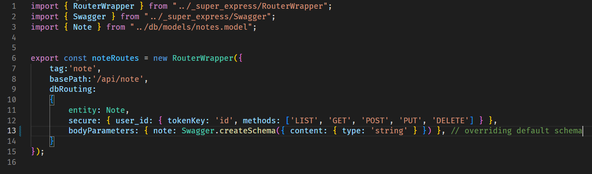
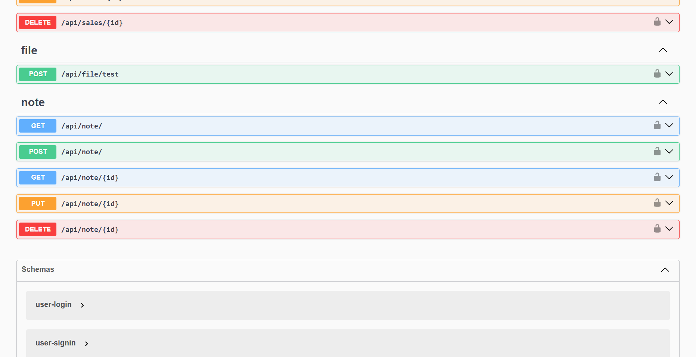
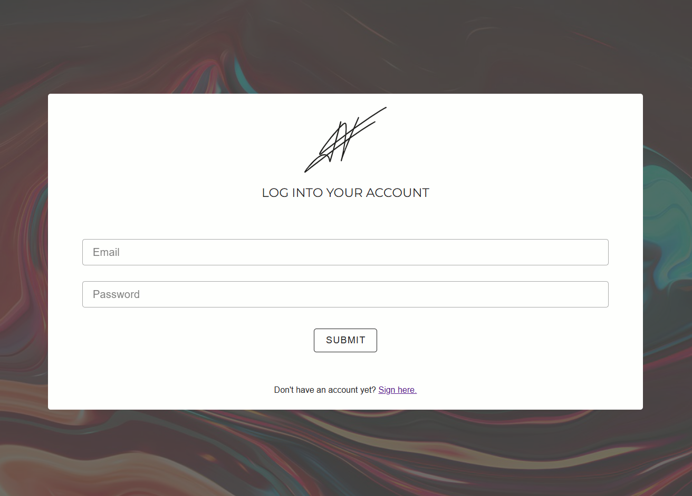
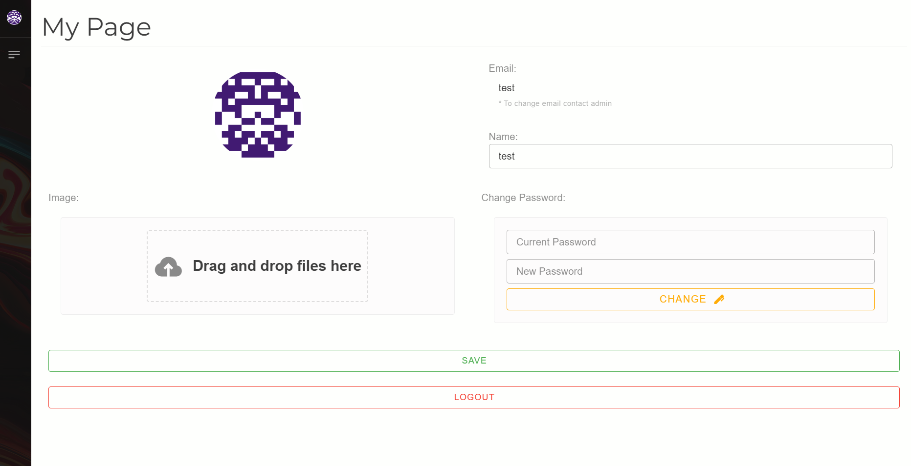

# Full Expresso Macchiato
> Still building this template, there are many things to take care of but at the moment you can already start building some simple apps.


<p align="center">
  
</p>

<p align="center">
  <!-- ⭐ GitHub Stars -->
  <a href="https://github.com/ExpressoMacchiato/ExpressoMacchiato/stargazers">
    
  </a>
  <!-- 🐛 Issues aperti -->
  <a href="https://github.com/ExpressoMacchiato/ExpressoMacchiato/issues">
    
  </a>
  <!-- 🔃 Pull Requests -->
  <a href="https://github.com/ExpressoMacchiato/ExpressoMacchiato/pulls">
    
  </a>
  <!-- 📦 Ultima Release -->
  <a href="https://github.com/ExpressoMacchiato/ExpressoMacchiato/releases">
    
  </a>
</p>

<p align="center">
  
  
  
</p>


<br>
<p align="center" style="font-size: 1.2rem;">
  💡 <strong>Check the full documentation</strong><br>
  👉 Visit <a href="https://alessios-books.gitbook.io/expresso-macchiato">expresso-macchiato docs</a> for the full API reference and guides.
</p>
<br>







This template is intented to use by me for fasten things up but feel free to use it and customize it however you want.
**It uses a little express wrapper that "near-to-automatically" serves swagger-ui and creates some dynamic endpoints for your api and db**.
You can check the dock in the `./back` folder README.

## ExpressoMacchiato
Check out [Expresso Macchiato](https://github.com/alessioVelluso/ExpressoMacchiato) wrapper to see how swagger and dynamic routes are generated

### Use
Both projects can be tested by going in their root folder (same level as their package.json) and using the command `npm run dev`.
For the build use `npm run build`.

For example
```
cd front
npm run build
```
Will produce the output file in the back/client folder, this. will be the final production UI.

```
cd back
npm run build
npm run prod
```

This will be creating the out files for the production server.

### Docker
For the container, you have the Dockerfile and also the compose instructions in the `./back` directory.
